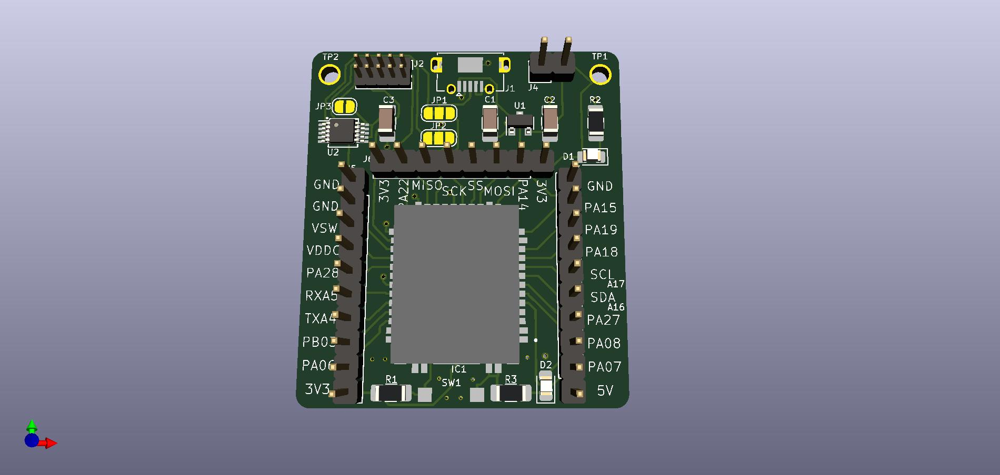

### WLR089U0-SAMR34-Dev-Board-LoRaWAN
Development board for Microchip's WLR089U0 LoRaWAN module consisting of the SAMR34 SiP IC 

### PCB Information:
1.  SAMR34 based SiP
2.  Inbuilt u.Fl connector, so no need to worry about RF tuning and impedance matching for PCB tracks
3.  Sleep current of ~2.4uA in Standby mode!
4.  Powered from the USB port
5.  Microchip MCP1700 3.3V LDO
6.  Inbuilt CH340E USB-UART converter. No need for any extra adapter. Serial comm works directly via the USB. CH340E does not require external crystals.
7.  SWD programming via the Cortex debug pin

### Firmware for the board
1.  Use Microchip Studio for firmware programming
2.  Install/Update Microchip ASF 3.48
3.  Open a New Example Project, search for SAMR34
4.  Use 'LoRaWAN Mote Application - SAMR34 Xplained Pro' project
5.  Be sure to choose MLS 1_0_P_4 from ASF version 3.48 (requires LoRaWAN core 1.0.2)
6.  Newer version of MLS 1_0_P_5 requires LoRaWAN core 1.0.4, which may not be compatible with many networks.

### Snapshots:
1. PCB Front

2. PCB Back

3. Finished product 

### Credits
Atul Kumar  (Third Year student, AY2020-2021)
Jithin Saji Isaac  
Don Bosco Institute of Technology, Mumbai  
Feb 2021
